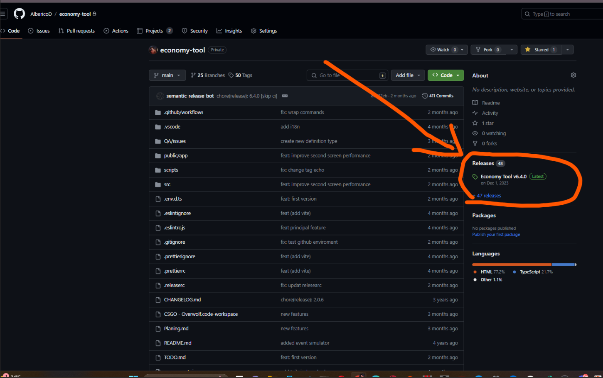
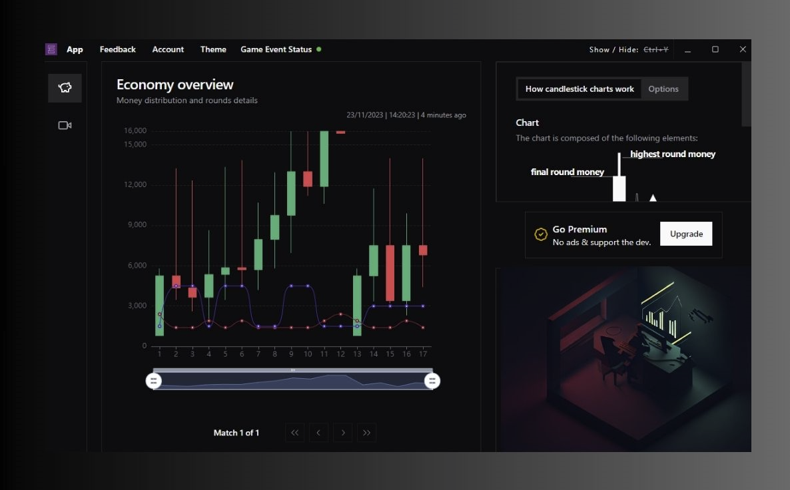

<h1 align="center">
  Overwolf Modern React Boilerplate
</h1>
<p align="center">
  
  <a href="https://github.com/AlbericoD/overwolf-modern-react-boilerplate/blob/master/LICENSE">
    
  </a>
  <a href="#contribution">
    
  </a>
   <a href="https://github.com/AlbericoD/overwolf-modern-react-boilerplate/actions/workflows/ci.yml">
    
  </a>
</p>

<h3 align="center">
  <a href="#-quick-start">Quickstart</a>
  <span> · </span>
  <a href="#-project-structure---feature-folder">Project structure</a>
  <span> · </span>
  <a href="https://www.npmjs.com/package/overwolf-hooks">Overwolf Custom Hooks</a>
  <span> · </span>
  <a href="#-remote-redux-debug">Remote Debug</a>
  <span> · </span>
  <a href="https://github.com/AlbericoD/overwolf-modern-react-boilerplate/blob/master/CONTRIBUTING.md">Contribution</a>
  <span> · </span>
</h3>

> This is the official [Overwolf Modern React Boilerplate](https://github.com/AlbericoD/overwolf-modern-react-boilerplate) template for [Create React App](https://github.com/facebook/create-react-app).

> OMRB is a free and open source opinionated boilerplate based on React that helps developers create fast, modular and modern overwolf app.

### Technology

<h4 align="center">
  <a href="https://reactjs.org/">React JS</a>
  <span> · </span>
  <a href="https://redux-toolkit.js.org/">Redux ToolKit</a>
  <span> · </span>
  <a href="https://www.i18next.com/">I18next</a>
  <span> · </span>
  <a href="https://github.com/reduxjs/redux-devtools">Redux Devtools - Remote</a>
   <span> · </span>
  <a href="https://overwolf.github.io/">Overwolf Api</a>
</h4>

- **Use a Modern Stack for Every App.** Create a uniform workflow for you and your team without ejecting the Create React App code.

- **Internationalization.** Support for multiple languages without having to change code.

- **Performance Is Baked In.** Custom hooks with functions and variables memoized for common uses in overwolf development.

- **Build.** Folders and structure ready for use in the overwolf store.

- **CI/CD** continuous development, continuous testing, continuous integration, continuous deployment

---

## 🚀 Quick Start

### Prerequisites

- Install [Node.js](https://nodejs.org)
- Install [npm](https://www.npmjs.com/)

To use this template, add `--template overwolf-typescript-redux` when creating a new app.

For example:

```sh
npx create-react-app my-app --template overwolf-typescript-redux

# or

yarn create react-app my-app --template overwolf-typescript-redux
```

For more information, please refer to:

- [Getting Started](https://create-react-app.dev/docs/getting-started) – How to create a new app.
- [User Guide](https://create-react-app.dev) – How to develop apps bootstrapped with Create React App.

## 📸 Screenshot

> this version the project is configured and ready to test with the Hearthstone game, you can use the template, compile and test without modifying anything to understand the development flow.

#### Desktop Window


#### InGame Window - 1


#### InGame Window - 2


## 💼 Project structure - Feature Folder.

Folder-by-type only works on small-scale projects. Folder-by-feature is superior in the majority of cases, is better due to its scalability, stands out in high modularity and cohesion. It allows us to play with the components' scope.

```text
.
|--- public
|---- # essencial files for overwolf store
|--- src
|    |--- app/
|    |----# global and shared components
|    |----lib/
|    |----# global and shared functions
|    |--- components/
|    |----# components that are not part of the application's business rule and can be reused in other features
|    |--- features/
|    |----# features that are part of the application's business rule and can be reused in other features
|    |--- screens/
|    |----# screens that are part of each entry point of the application from the ovewolf manifest
|    |--- locales/
|    |-----------de/**/*.json
|    |-----------de/index.ts
|    |-----------en/**/*.json
|    |-----------en/index.ts
|    |-----------es/**/*.json
|    |-----------es/index.ts
|    |-----------fr/**/*.json
|    |-----------fr/index.ts
|    |-----------it/**/*.json
|    |-----------it/index.ts
|    |-----------ko/**/*.json
|    |-----------ko/index.ts
|    |-----------pl/**/*.json
|    |-----------pl/index.ts
|    |-----------pt/**/*.json
|    |-----------pt/index.ts
|    |-----------ru/**/*.json
|    |-----------ru/index.ts
|    |-----------tr/**/*.json
|    |-----------tr/index.ts
|    |-----------index.ts
|    |--- index.tsx
|    |--- overwolf.dev.mock.ts
|    |--- react-app-env.d.ts
|    |--- setupTests.ts
|--- .gitignore
|--- LICENSE
|--- README.md
|--- package-lock.json
|--- package.json
|--- tsconfig.json
.
```

## 🐛 Remote Redux Debug.

In overwolf it is not possible to install plugins to debug the code, so the alternative is to use something remote to debug an injected code.

1. **Install tool.**

- Install [Redux DevTools](https://chrome.google.com/webstore/detail/redux-devtools/lmhkpmbekcpmknklioeibfkpmmfibljd?hl)
  in common browser.

2. **Configure**

- if the installation is correct, a redux dev tools icon should appear in your browser's toolbar.
- click into icon then choose **"Open remote devTools"**
- click into settings option and let hostname called to **"localhost"** and port **8081**.

3. **Run Server Bridge**

- run the server that bridges the remote redux and the overwolf application.
  ```shell
  cd overwolf-modern-react-boilerplate
  npm run start-remote-server
  ```

4. **Start debugging**
   > whenever you want to debug your app store, just remember to use the **remote redux dev tools** + **the bridge server**

## 📦 Build/Create package for overwolf store.

you need to create an optimized version of your code and the correct structure before sending it to the overwolf store.
[Overwolf Doc: How to submit an app](https://overwolf.github.io/docs/start/submit-your-app-to-the-store#how-to-submit-an-app)

1. **Compile**

   ```shell
   #Change into directory
   cd overwolf-modern-react-boilerplate
   npm run build:overwolf
   ```

2. **Edit Changelog**

   > To make it easier for users, contributors and overwolf team to see precisely what notable changes have been made between each release (or version) of the project.

3. **Send .zip** (if it is the first time you are sending the app, you need to send the .zip file to the overwolf team, so that they can create the app in the store)

- the generated code is located in `|--- build/**/.**`
- Package all **build/** folders to .zip _(the command above already does this for you)_
- just send your .zip code to the overwolf test team. _(package.vx.x.x.zip)_

```shell
$ vi project-root/CHANGELOG.md
```

## 📦 🔃 🛎️ CI/CD

> throughout the development cycle testing or releasing small updates can become a bit tedious, so there is also a github action setting when you generate a new project, you don't actually need to do any extra steps if you use github, this means that whenever you add valid code to the main branch, then an automatic github action will do all the compiling and packaging steps automatically.

About [ CI/CD File.yml](https://raw.githubusercontent.com/AlbericoD/overwolf-modern-react-boilerplate/master/template/.github/workflows/overwolf-opk.yml)

## Configure Github Actions with secrets and environment variables

### variables

| Name                | Description         | type   |
| ------------------- | ------------------- | ------ |
| PRE_RELEASE_CHANNEL | overwolf channel id | number |

> Note: Test Channel IDs from overwolf-cli
> Several commands work with test channels. While we plan to accept the channel's name, for now, we expect to receive the channel ID as the argument. You can find the channel's ID in the page URL of the channel in the Dev Console.

### secrets

| Name           | Description          | type   |
| -------------- | -------------------- | ------ |
| OW_CLI_EMAIL   | overwolf dev email   | string |
| OW_CLI_API_KEY | overwolf dev api key | string |

> Check out some screenshots of what github actions looks like:




## 🤝 Contributing

Contributions, issues and feature requests are welcome!

## Projects using OMRB

> If you are using OMRB in your project, please let me know! I'll be happy to list it here.

- [Fortmapp](https://www.overwolf.com/app/Alberico_Dias_Barreto_Filho-Fortmapp)

  > A map for Fortnite Battle Royale.
  > 

- [Economy Tool](https://www.overwolf.com/app/Alberico_Dias_Barreto_Filho-Economy_Tool)

  > A tool to help you manage economy in the cs2.
  > 
